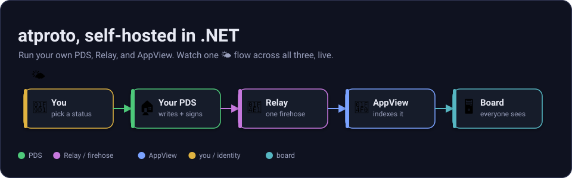

# atproto-net-selfhost-aspire

A from-scratch .NET stack for self-hosting atproto: your data home, a shared wire, and a live AppView, all wired with .NET Aspire.

## What is this?

atproto is easiest to picture as **email + a newswire + a newspaper**. Your **Personal Data Server (PDS)** is like your email provider, your data lives there and you can switch providers. The **Relay** is like a newswire that aggregates public activity into one feed, the **firehose**. The **AppView** is like a newspaper or search index that reads the wire and builds something readable.

This repo implements the core services in .NET: a Personal Data Server (PDS), a Relay, and an AppView. The demo app is a presence board where accounts set one emoji status and everyone sees the latest statuses update live over SignalR.



*Figure: PDSes hold user data, the Relay aggregates public commits, and the AppView builds the live board.*

## The life of an emoji

You pick 🌤. The app writes one `place.selfhost.status` record with key `self` to your PDS. The PDS signs a repo commit and emits a `#commit` frame, the Relay assigns a global sequence, the AppView projects latest status per account, and SignalR makes the row flash on everyone's board.

Read the full walkthrough in [docs/how-it-works.md](docs/how-it-works.md).

## Quickstart

### Prerequisites

- .NET SDK 10.0.300, pinned in [global.json](global.json).
- .NET Aspire CLI 13.x.
- A single valid HTTPS dev certificate.

Run this once on a fresh machine:

```bash
dotnet dev-certs https --clean
dotnet dev-certs https --trust
```

Then run the orchestrated stack:

```bash
aspire run --project src/aspire/AtProto.AppHost
```

On Windows Subsystem for Linux (WSL), use the all-HTTP launch profile. The Aspire HTTPS dashboard bind can fail under WSL even when a dev cert exists, so this path is the most reliable:

```bash
ASPIRE_ALLOW_UNSECURED_TRANSPORT=true \
  dotnet run --project src/aspire/AtProto.AppHost/AtProto.AppHost.csproj --launch-profile http
```

HTTP profile ports:

| Service | URL |
| --- | --- |
| Aspire dashboard | `http://localhost:15194` |
| PDS | `http://localhost:5271` |
| Relay | `http://localhost:5333` |
| AppView board | `http://localhost:5193` |

### Durable production profile (optional)

By default the stack runs **in-memory**: zero configuration, nothing on disk, disposable. To run the
durable **production** profile instead, set one environment variable. Each Personal Data Server (PDS)
then writes accounts, repositories, and blobs through to SQLite (they survive a restart), and a
[DuckDB analytics view](docs/analytics.md) is added over the same firehose:

```bash
ASPIRE_ALLOW_UNSECURED_TRANSPORT=true ATPROTO_PROFILE=production \
  dotnet run --project src/aspire/AtProto.AppHost/AtProto.AppHost.csproj --launch-profile http
```

Nothing is removed by turning this on. In-memory stays the default and the test default. See
[storage profiles](docs/storage.md) for the toggle, the SQLite schema, and what survives a restart.

You can also point the analytics view at the **real public Bluesky firehose** to see live global
aggregates, no self-hosting required:

```bash
dotnet run --project src/services/AtProto.AnalyticsView/AtProto.AnalyticsView.csproj \
  --launch-profile bluesky
```

This streams the live network (`relay1.us-west.bsky.network`) into an in-memory DuckDB, the strongest
proof this .NET stack speaks atproto correctly. See [pointing it at the live network](docs/analytics.md#point-it-at-the-live-bluesky-network).

## What you can do

- Watch the live presence board update from self-hosted demo accounts.
- Compose your own 🌤 status through the app explorer.
- Click a row to inspect the real record, its AT-URI, and its Content Identifier (CID).
- Explore a repo and download its Content Addressable aRchive (CAR) file.
- Watch raw firehose commits flow through the live ticker.
- Query the PDS, Relay, and AppView typed HTTP endpoints (XRPC) directly.

Example record:

```json
{
  "$type": "place.selfhost.status",
  "status": "🌤",
  "createdAt": "2026-07-29T16:00:00.000Z"
}
```

Example AT-URI:

```text
at://did:web:localhost%3A5271:pds:demo1/place.selfhost.status/self
```

## Who is this for?

- .NET developers who want to learn atproto without starting from a TypeScript stack.
- People exploring self-hosted personal data and portable identity.
- Teams that want an internal "who's around" presence board on infrastructure they control.
- Protocol builders who need a small reference and interop harness.

See [docs/scenarios.md](docs/scenarios.md).

## Documentation

Start here:

1. [Primer](docs/primer.md), atproto in plain language.
2. [How it works](docs/how-it-works.md), the life of a 🌤 status.
3. [Architecture](docs/architecture.md), exact service wiring.
4. [Reactive design](docs/reactive-design.md), pull ingest, `IObservable` seam, Rx projection, SignalR push.
5. [Services](docs/services.md), endpoint and config reference.
6. [Scenarios](docs/scenarios.md), why this exists and where it fits.
7. [Packaging](docs/packaging.md), the extractable libraries and how preview packages are built.
8. [Extending](docs/extending.md), build on the stack: reuse a library, add a lexicon, build a projection, swap storage, compose a topology.
9. [Storage profiles](docs/storage.md), the durable production profile (SQLite PDS) vs the in-memory default.
10. [Analytics view](docs/analytics.md), the DuckDB OLAP projection production adds over the same firehose.

The dense implementation log is [docs/plan.md](docs/plan.md). To build or change the stack, see [CONTRIBUTING.md](CONTRIBUTING.md).

## Layout

```text
src/
  core/      AtProto.Cbor · Cid · Car · Crypto · Repo · Identity · Lexicon · Firehose
  services/  AtProto.Pds · AtProto.Relay · AtProto.AppView
  apps/      AtProto.FirehoseProbe · AtProto.StatusSeeder
  aspire/    AtProto.AppHost · AtProto.ServiceDefaults · AtProto.Hosting.Atproto
lexicons/    custom lexicon JSON for the demo status record
tests/       core interop vectors, firehose, integration, hosting
docs/        newcomer docs and implementation notes
```

## Roadmap

The build is phased. Each milestone is independently demoable.

- **M0** - repo bootstrap and Aspire skeleton, done.
- **T0** - golden-vectors fixture harness with real repo CARs, CIDs, and MST roots, done.
- **M1** - reactive firehose core, validated against the public Bluesky relay, done.
- **M2** - AppView presence board over the public firehose, done.
- **M3** - self-hosted PDS with `did:web`, MST build, commit signing, CAR write, and XRPC endpoints, done.
- **M4** - self-hosted Relay with upstream crawl, global sequence, and aggregated firehose, done.
- **M5** - Aspire orchestration plus native hosting integrations, done.
- **Live SignalR UI** - board updates from server-driven projection deltas, done.
- **Explorer + docs + preview packages** - inspect real records/repos/CAR, compose your own status, a live firehose ticker, a rich SVG-illustrated docs set, and nine extractable preview NuGet packages, done.
- **M6 stretch** - mostly landed: federation discovery (each PDS advertises a `place.selfhost.instance` record and `requestCrawl`s the relay; the AppView `/directory` aggregates two PDS instances one relay crawls), `did:plc` creation, blob upload/fetch, stricter Relay MST verification, lexicon-to-C# codegen, and multi-targeting the core libraries (`net9.0;net10.0`). Remaining: a full OAuth authorization server and publishing the libraries to nuget.org once the API surface settles.
- **Production profile** - a durable, opt-in "real-world" stack: SQLite-backed PDS (accounts, repositories, and blobs survive a restart) plus a [DuckDB analytics AppView](docs/analytics.md) over the same firehose, both behind `ATPROTO_PROFILE=production`; in-memory stays the zero-config default. The preview libraries publish to [GitHub Packages](docs/packaging.md) on a version tag. Done.

## License

This project is licensed under the [MIT License](LICENSE), permissive: anyone may use, modify, and redistribute it, including commercially, with no copyleft, provided the copyright and license notice are retained.

**Third-party:**

- The bundled SignalR browser client (`src/services/AtProto.AppView/wwwroot/lib/signalr/signalr.min.js`) is part of ASP.NET Core, © .NET Foundation and Contributors, MIT, see its [`LICENSE.txt`](src/services/AtProto.AppView/wwwroot/lib/signalr/LICENSE.txt).
- The golden test fixtures under `tests/fixtures/` are public AT Protocol data captured from the `atproto.com` reference account (`did:plc:ewvi7nxzyoun6zhxrhs64oiz`), see [`tests/fixtures/README.md`](tests/fixtures/README.md).
