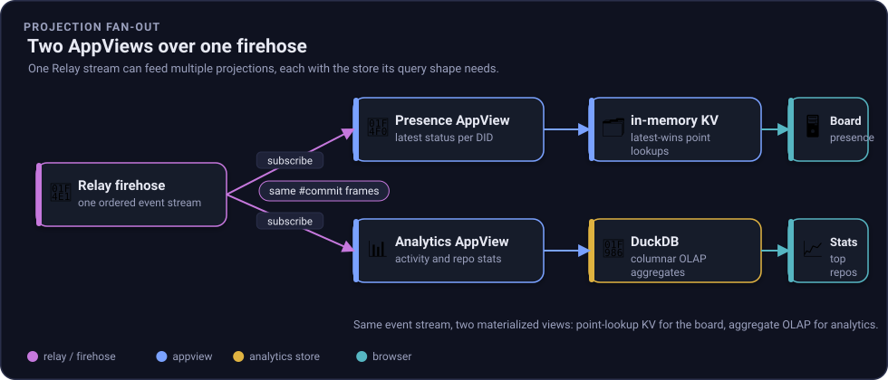

# Analytics view: a DuckDB projection over the firehose

The presence board answers one question well: *what is each account's latest status?* It is a
latest-wins key/value read model, a point lookup. It structurally cannot answer *how many records per
collection?*, *which repos are busiest?*, or *what did activity look like over the last 30 minutes?*
Those are aggregate, columnar questions. That is what the analytics view is for.

The analytics view is a **second AppView over the same firehose**, backed by
[DuckDB](https://duckdb.org). It is part of the [production profile](storage.md) and is added when you
run with `ATPROTO_PROFILE=production`.



*Figure: one Relay firehose, two projections. The presence AppView keeps an in-memory key/value read
model for the board; the analytics AppView writes every op into a DuckDB columnar store for aggregate
queries. Same event stream, two materialized views.*

## OLTP vs OLAP, and why a second store

| | Presence AppView | Analytics AppView |
| --- | --- | --- |
| Question | latest status per account | totals, rates, top-N, breakdowns |
| Access shape | point lookup (OLTP-ish) | aggregate scan (OLAP) |
| Store | in-memory key/value | **DuckDB** columnar |
| Filters | one collection (`place.selfhost.status`) | **every op from every collection** |
| Read model | latest-wins | append-only event log |

This is the same lesson as the storage-roles table in [storage.md](storage.md#right-tool-per-storage-role):
match the store to the access shape. A columnar engine makes `GROUP BY collection`, `count(DISTINCT
did)`, and time-bucketed activity cheap, which a latest-wins dictionary cannot do at all.

It is also a live example of [Path D](extending.md#path-d---build-your-own-appview-projection): a new
projection plugs into the same firehose boundary as the presence board, just with the store its query
shape needs.

## What it ingests

The ingest loop mirrors the presence view's (a pull-based `await foreach` over the bounded-channel
firehose client, cursor-checkpointed after each event, see [reactive design](reactive-design.md)), with
two differences: it keeps **every** op from **every** collection, and it does not decode record bodies,
so it needs no Rx. Each op becomes one row:

```sql
CREATE TABLE events (
    seq        BIGINT,      -- firehose global sequence
    did        VARCHAR,     -- repo (account) DID
    collection VARCHAR,     -- NSID, e.g. app.bsky.feed.post
    rkey       VARCHAR,     -- record key
    action     VARCHAR,     -- create | update | delete
    cid        VARCHAR,     -- record CID (null for deletes)
    ts         TIMESTAMP    -- commit time
);
```

**Single-writer discipline:** the ingest loop and the read endpoints share one DuckDB connection (which
is not thread-safe), so every append and every query is serialized under one lock. Writes use the DuckDB
Appender for a fast bulk path, one batch per commit. At self-host scale this is a non-issue and keeps the
store trivially correct.

## Endpoints

XRPC-style GET routes, served alongside a small analytics page at `/`:

| Route | Returns |
| --- | --- |
| `/xrpc/place.selfhost.getFirehoseStats` | total events, plus breakdowns by collection and by action |
| `/xrpc/place.selfhost.getActivity?unit=minute&limit=30` | time-bucketed counts (oldest first) for a sparkline |
| `/xrpc/place.selfhost.getTopRepos?limit=10` | busiest repos (DIDs) by event count |
| `/xrpc/place.selfhost.getCollections` | per-collection event count and distinct-repo count |

The bundled page (`wwwroot/index.html`) polls these every two seconds and renders totals, a per-minute
activity sparkline, per-action pills, a collections table, and a top-repos table.

## How to run and inspect

Bring up the production profile (see [storage.md](storage.md#how-to-run-production)):

```bash
ATPROTO_PROFILE=production aspire run --project src/aspire/AtProto.AppHost
```

Open the **`analyticsview`** resource from the Aspire dashboard, or query it directly:

```bash
curl -s http://localhost:<analyticsview-port>/xrpc/place.selfhost.getFirehoseStats | jq
```

Because the store is a plain DuckDB file (`atproto-data/analytics/analytics.duckdb`), you can also open
it with the DuckDB CLI and run ad hoc SQL:

```sql
SELECT collection, count(*) FROM events GROUP BY collection ORDER BY 2 DESC;
```

## Point it at the live Bluesky network

The same analytics view can consume the **real public Bluesky firehose** instead of your self-hosted
Relay. Nothing about the code changes: the firehose client, the CBOR/CAR decode path, and the DuckDB
ingest are all protocol code, so pointing them at `relay1.us-west.bsky.network` is the strongest proof
that this .NET stack speaks atproto correctly. It consumes the same wire format that production Bluesky
emits, unmodified.

A `bluesky` launch profile runs the view standalone against the live network, into an in-memory DuckDB:

```bash
dotnet run --project src/services/AtProto.AnalyticsView/AtProto.AnalyticsView.csproj \
  --launch-profile bluesky
```

That profile sets two environment variables (see `Properties/launchSettings.json`):

| Variable | Value | Effect |
| --- | --- | --- |
| `Firehose__RelayHost` | `relay1.us-west.bsky.network` | subscribe to the public Bluesky relay (canonical alternative: `bsky.network`) |
| `Analytics__DuckDbPath` | `:memory:` | keep the whole projection in RAM, an ephemeral live tail |

Then browse to `http://localhost:5300` (or query the same endpoints as above). Within a minute you are
looking at real aggregates over live global activity, for example:

```text
Analytics ingest: source relay1.us-west.bsky.network, resume none
total ops: 7964
app.bsky.feed.like=5276, app.bsky.feed.post=1049, app.bsky.feed.repost=912,
app.bsky.graph.follow=472, app.bsky.feed.threadgate=64
```

The distribution is authentic (likes dominate, then posts, reposts, and follows), the repos are real
`did:plc:...` accounts, and the long tail includes third-party lexicons the presence board never sees.

**A few things to know for the live tail:**

- The firehose is high volume (roughly 250 to 800 ops per second), so `:memory:` is the right choice for
  a throwaway demo. The projection is gone when you stop the process, which is what you want here.
- A fresh run starts at the **live tip** (`resume none`) and streams forward. The view still checkpoints
  a resume cursor next to the binary (`analyticsview-cursor.txt`, gitignored), so re-running continues the
  live tail without gaps. Delete that file to force a restart from the tip.
- This standalone mode does not need Aspire or the production profile. It is the analytics view on its
  own, pointed at someone else's Relay, which is exactly how a real third-party AppView would consume the
  network.

The production profile (above) points this same service at your **self-hosted** Relay instead. Live
Bluesky proves interop; the self-hosted profile proves the whole loop is yours end to end.

## Why not the Aspire DuckDB hosting resource?

The service depends on `DuckDB.NET.Data.Full`, which bundles the DuckDB native library and opens the
embedded database in-process. The CommunityToolkit `AddDuckDB` **hosting** resource targets a newer
Aspire than this stack pins, so instead of chasing a version bump for one resource, the AppHost injects
the DuckDB file path as the `analytics` connection string via plain Aspire config. The runtime behavior
is identical (a DuckDB-backed view wired by Aspire, visible in the dashboard) and the whole stack stays
on one Aspire version. If a matching hosting package lands, swapping to `AddDuckDB(...).WithReference(...)`
changes only the AppHost, not the service, because the service already reads a standard connection string.

## Verify

`tests/AtProto.AnalyticsView.Tests/AnalyticsStoreTests.cs` drives synthetic commits into a real DuckDB
instance (which also proves the native library loads on this platform) and asserts every aggregate:
totals, per-collection and per-action breakdowns, top-N repos, distinct-repo counts, minute buckets, and
that a file-backed store survives a reopen.

```bash
dotnet test tests/AtProto.AnalyticsView.Tests
```

## See also

- [Storage profiles](storage.md), the dev/production split and the SQLite PDS store.
- [Extending: build your own AppView projection](extending.md#path-d---build-your-own-appview-projection).
- [Reactive design](reactive-design.md), why ingest is pull-based.
