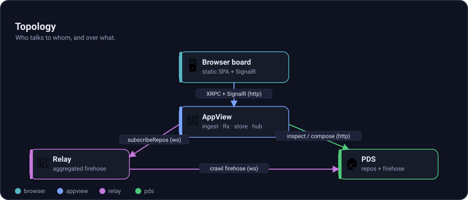
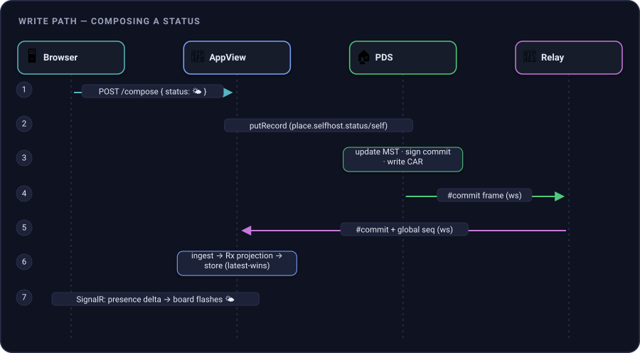
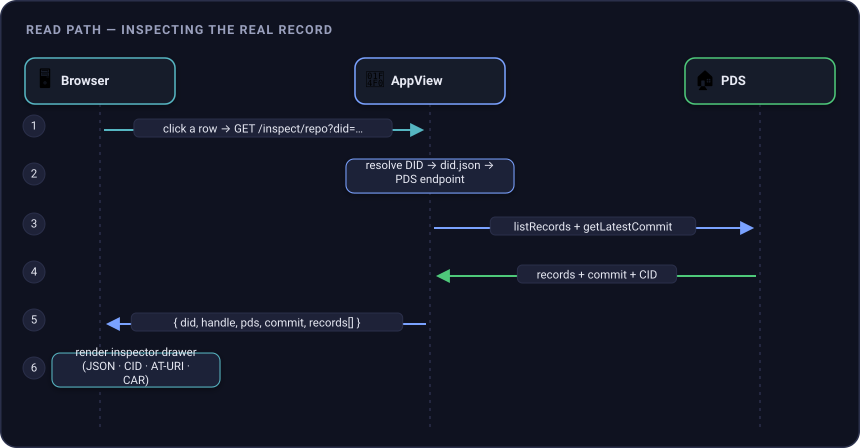
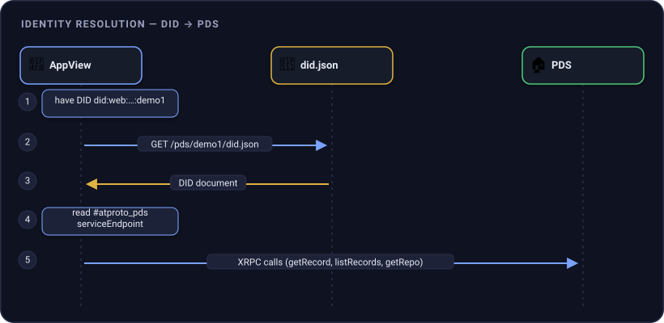
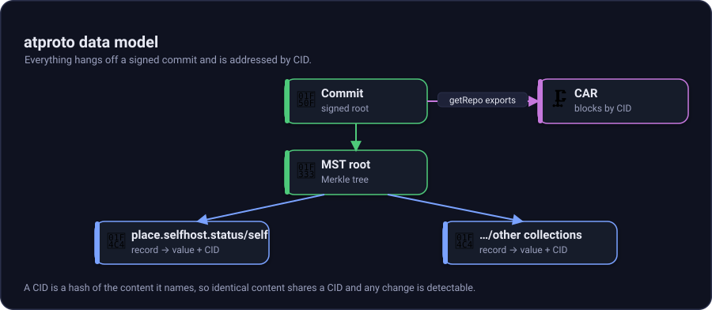

# Architecture

This page is for readers who want exact wiring. First-use acronyms here: Personal Data Server (PDS), Decentralized Identifier (DID), Content Addressable aRchive (CAR), and typed HTTP endpoints (XRPC). If you are new to atproto, read [the primer](primer.md) first.

## Topology



*Figure: The browser talks to the AppView, the AppView reads the Relay firehose, and inspect paths can fetch records from the source PDS.*

Aspire declares the stack in `src/aspire/AtProto.AppHost/AppHost.cs`:

```csharp
var pds = builder.AddAtprotoPds<Projects.AtProto_Pds>("pds");

var relay = builder.AddAtprotoRelay<Projects.AtProto_Relay>("relay")
    .WithUpstream(pds);

builder.AddAtprotoAppView<Projects.AtProto_AppView>("appview")
    .WithFirehose(relay)
    .WithCollection("place.selfhost.status");
```

The hosting integration encodes the env-var contract in `src/aspire/AtProto.Hosting.Atproto/AtprotoHostingExtensions.cs`.

## Write path



*Figure: The write path starts as a simple emoji and ends as a signed repo event projected into the live board.*

Code pointers:

- Compose explorer surface: `src/services/AtProto.AppView/Program.cs` in the explorer workstream.
- PDS write mapping: `src/services/AtProto.Pds/PdsHost.cs`, `MapRepo`.
- Commit creation: `src/services/AtProto.Pds/PdsService.cs`, `Commit`.
- Repo internals: `src/core/AtProto.Repo/RepoStore.cs`.
- Relay global sequence: `src/services/AtProto.Relay/RelayService.cs`.
- AppView projection: `FirehoseIngestService.cs`, `PresenceProjection.cs`, `PresenceStore.cs`.
- Browser push: `PresenceBroadcaster.cs` and `/hub/presence` in `Program.cs`.

## Read and inspect path



*Figure: Inspect starts with the record's DID, finds the PDS in the DID document, and fetches the record by XRPC.*

Direct PDS call:

```bash
curl 'http://localhost:5271/xrpc/com.atproto.repo.getRecord?repo=did:web:localhost%3A5271:pds:demo1&collection=place.selfhost.status&rkey=self'
```

Response shape:

```json
{
  "uri": "at://did:web:localhost%3A5271:pds:demo1/place.selfhost.status/self",
  "cid": "<record-cid>",
  "value": {
    "$type": "place.selfhost.status",
    "status": "🌤",
    "createdAt": "2026-07-29T16:00:00.000Z"
  }
}
```

## Identity resolution



*Figure: `did:web` turns a DID into an HTTP DID document, and the document points clients at the PDS.*

The PDS service Decentralized Identifier (DID) is `did:web:localhost%3A5271`. A hosted account DID is `did:web:localhost%3A5271:pds:demo1`. See `PdsOptions.cs` and `PdsHost.cs`.

## Data model graph



*Figure: Each account owns a repo, each repo has a signed head commit, and each status record is addressed by collection and record key.*

The status record is:

```json
{
  "$type": "place.selfhost.status",
  "status": "🌤",
  "createdAt": "2026-07-29T16:00:00.000Z"
}
```

## Service boundaries

| Service | Port in HTTP profile | Owns | Does not own |
| --- | ---: | --- | --- |
| PDS | 5271 | accounts, sessions, repos, DID docs, source firehose | global aggregation |
| Relay | 5333 | upstream crawl, global firehose sequence, host state | repo storage |
| AppView | 5193 | presence read model, board API, SignalR push, explorer UI | authoritative repo writes |
| Aspire dashboard | 15194 | orchestration view | protocol state |

For the .NET dataflow inside the AppView, continue to [Reactive design](reactive-design.md).
