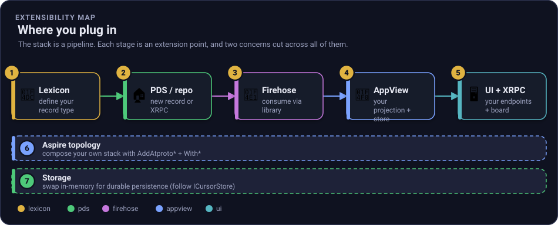

# Extending the stack

This repo is a **hero app first, a library set second**. It runs as one Aspire solution you can clone
and start, but every piece is built to be built on. This guide is the map: it shows where you plug in,
what is already a clean seam, what is not yet, and the concrete steps for each path.

If you are new to the protocol, read the [primer](primer.md) and [how it works](how-it-works.md)
first. If you know atproto and want to build, start here.

## The mental model: a pipeline you can plug into

The stack is a pipeline. A record type (lexicon) is written to a repo on a PDS, the PDS emits a commit
on its firehose, a Relay aggregates firehoses, and an AppView projects the stream into a read model it
serves over HTTP. Each stage is an extension point. Two concerns, the Aspire topology and storage, cut
across all of them.



*Figure: the five pipeline stages are extension points (1-5); the Aspire topology (6) and storage (7)
cut across all of them.*

## I want to... (pick a path)

| I want to... | Path | Where you work |
| --- | --- | --- |
| Use one piece of atproto in .NET (read a CAR, decode a firehose) | [A](#path-a---reuse-one-library-in-your-own-app) | a preview NuGet package |
| Store a new kind of record | [B](#path-b---define-your-own-lexicon) | `lexicons/` + the codegen tool |
| Show a different existing collection on the board | [C](#path-c---index-a-different-collection) | one config value |
| Build a read model for my own lexicon | [D](#path-d---build-your-own-appview-projection) | a new projection + store |
| Add an API to a service | [E](#path-e---add-a-new-xrpc-or-http-endpoint) | a service `Program.cs` / host |
| Persist data or swap storage | [F](#path-f---persist-or-swap-storage) | a store interface |
| Run my own multi-service topology | [G](#path-g---compose-your-own-topology-with-aspire) | the AppHost |
| Change how identity works | [H](#path-h---choose-your-identity-method) | `AtProto.Identity` |
| Log in a real third-party client and write to a repo | [I](#path-i---bring-your-own-oauth-client) | a `client-metadata.json` + `AtProto.OAuth` |

Each path below lists **when to use it**, **the steps**, a **minimal shape**, **code pointers**, and
**how to verify**.

## Path A - Reuse one library in your own app

**When:** you want just one capability (content-addressed blocks, CAR read/write, a firehose client,
MST build/read) inside your own project, without adopting the whole stack.

Ten libraries are layered so the core never depends on a service, which is what makes them
extractable. See [packaging](packaging.md) for the full layer map and the preview-feed setup.


**Steps:**

1. Add the GitHub Packages feed (from [packaging](packaging.md#install-from-github-packages)):

   ```bash
   dotnet nuget add source https://nuget.pkg.github.com/luisquintanilla/index.json \
     --name github-atproto \
     --username "$GITHUB_USERNAME" \
     --password "$GITHUB_TOKEN" \
     --store-password-in-clear-text
   ```

2. Reference the one package you need:

   ```bash
   dotnet add package AtProto.Car --version 0.3.0-preview.1 --source github-atproto
   ```

**Minimal shape** (read a repo export, then decode a live firehose):

```csharp
using AtProto.Car;
using AtProto.Firehose;

// Read a CARv1 repo export and check every block hashes to its CID.
CarArchive repo = CarReader.Read(File.ReadAllBytes("repo.car"));
repo.VerifyIntegrity();
byte[] commitBlock = repo.GetBlock(repo.Roots[0]);

// Decode the public firehose. The pull stream needs no System.Reactive.
var client = FirehoseClient.ForRelay("relay1.us-west.bsky.network");
await foreach (RepoEvent ev in client.SubscribeAsync())
    if (ev is RepoCommitEvent commit)
        foreach (RepoOp op in commit.Ops)
            Console.WriteLine($"{op.Action} {op.Collection}/{op.Rkey}");
```

If you want Rx operators, adapt the pull stream to a BCL `IObservable<T>` with
`source.ToObservable()` from `FirehoseObservable`, then opt into `System.Reactive` yourself.

**Code pointers:** [`AtProto.Car/CarReader.cs`](https://github.com/luisquintanilla/atproto-dotnet/blob/main/src/core/AtProto.Car/CarReader.cs),
[`AtProto.Firehose/FirehoseClient.cs`](https://github.com/luisquintanilla/atproto-dotnet/blob/main/src/core/AtProto.Firehose/FirehoseClient.cs),
[`AtProto.Firehose/FirehoseObservable.cs`](https://github.com/luisquintanilla/atproto-dotnet/blob/main/src/core/AtProto.Firehose/FirehoseObservable.cs).

**Verify:** your project builds against the package, and `VerifyIntegrity()` does not throw on a real
`repo.car` (the fixtures under `tests/fixtures/` are real repo exports).

## Path B - Define your own lexicon

**When:** you want to store a new record type (a post, a bookmark, a check-in) instead of the demo
`place.selfhost.status`.

A lexicon is a small JSON schema. This repo ships a generator that turns a record lexicon into a typed
C# record, so your writer and reader agree on shape at compile time.

**Steps:**

1. Write the schema under `lexicons/`, modeled on `lexicons/place.selfhost.status.json`. Use your own
   reverse-DNS NSID (for example `com.example.note`).
2. Generate a typed record:

   ```bash
   dotnet run --project tools/AtProto.Lexicon.CodeGen -- \
     lexicons/com.example.note.json src/YourApp/Note.g.cs --namespace YourApp.Lexicons
   ```

   With no output path it writes the C# to stdout, so you can pipe or inspect it first.
3. Write records to a repo with that NSID as the collection (the PDS `createRecord` / `putRecord`
   endpoints in [services](services.md)); index them with Path C or Path D.

**Code pointers:** `tools/AtProto.Lexicon.CodeGen/` (the CLI and `LexiconCodeGenerator`),
`lexicons/place.selfhost.status.json` (a worked example).

**Verify:** the generated file compiles in your project. The generator itself is covered by a Roslyn
compile check in `tests/AtProto.Lexicon.CodeGen.Tests/`.

## Path C - Index a different collection

**When:** your records have the **same latest-wins-per-account shape** as the demo (one current value
per DID) but a different NSID. This is a config change, no code.

The AppView indexes exactly one collection, chosen by `AppView__Collection` (default
`place.selfhost.status`). The ingest loop skips ops whose collection does not match.

**Steps:**

- Standalone: set the environment variable.

  ```bash
  AppView__Collection=com.example.note \
    dotnet run --project src/services/AtProto.AppView/AtProto.AppView.csproj --launch-profile http
  ```

- Under Aspire: `AddAtprotoAppView<...>().WithCollection("com.example.note")` (see Path G).

**Code pointers:** `src/services/AtProto.AppView/FirehoseIngestService.cs` (the
`op.Collection != collection` filter), `AtProto.Hosting.Atproto/AtprotoHostingExtensions.cs`
(`WithCollection`).

**Verify:** write a record in the new collection to your PDS and confirm it appears on the board. If
your record is **not** latest-wins-per-account (a feed of many posts, a like graph), you need a
different read model: go to Path D.

## Path D - Build your own AppView projection

**When:** your lexicon needs a different read model than "one current value per account" (a timeline, a
count, a join across records). The AppView's presence projection is one shape, not the only shape.

The ingest path is deliberately layered so you can copy it. A firehose is decoded into `RepoEvent`s
(pull, BCL only); ops matching your collection are normalized into a small update record; that update
stream is handed to an Rx projection that owns the time domain and materializes a store; endpoints read
the store. Rx.NET stays scoped to this projection layer. See [reactive design](reactive-design.md).


**The pattern to copy** (four small pieces, all in `src/services/AtProto.AppView/`):

| Piece | Demo file | What you change |
| --- | --- | --- |
| Normalized update record | `Model.cs` (`StatusUpdate`) | your fields |
| Materialized store (pure, testable) | `PresenceStore.cs` (`Apply`/`Snapshot`) | your read model |
| Rx projection | `PresenceProjection.cs` (`Connect(IObservable<...>)`) | your aggregation |
| Ingest + endpoints | `FirehoseIngestService.cs`, `Program.cs` | map ops to your update, serve your store |

**Minimal shape** (your projection consumes a BCL observable of your update type):

```csharp
public sealed class NoteProjection(NoteStore store)
{
    public IDisposable Connect(IObservable<NoteUpdate> updates) =>
        updates.Subscribe(u => store.Apply(u));   // add Rx operators as needed
}
```

Feed it from ingest exactly as the demo does, filtering `op.Collection` to your NSID and turning each
op into your update record (the demo reads the emoji out of the commit's CAR slice with
`CarReader.Read(commit.Blocks)` plus a DAG-CBOR field read; do the same for your fields).

**Code pointers:** `src/services/AtProto.AppView/{FirehoseIngestService.cs, PresenceProjection.cs,
PresenceStore.cs, Model.cs, Program.cs}`.

**Verify:** keep the store pure (no Rx) so you can unit-test latest-wins/aggregation without timing,
the way `tests/AtProto.AppView.Tests/` tests `PresenceStore` and `PresenceProjection` directly.

## When would you add a message broker (NATS/JetStream)?

**When:** you need firehose fan-out or replay across processes, across nodes, or across many durable
consumers. Until then, the in-memory broadcaster is the right default.

The seam is `FirehoseBroadcaster` in `AtProto.Firehose`. It is the current in-memory sequencer and
fan-out point: `Publish` and `PublishNext` assign or accept monotonic sequence numbers, `Subscribe(cursor)`
replays retained frames after a cursor and then streams live frames, and `_backfill` keeps a bounded
in-memory replay window. A broker would sit **behind that seam** as a swap-in for fan-out and replay. It
should not become a new core dependency that every single-node app has to carry.

Why not put JetStream in core now?

1. The firehose is a **derived stream**. The PDS repositories are the source of truth, so the stream can
   be rebuilt from repo commits if needed.
2. The core thesis is BCL-first and minimal dependency. The current in-memory broadcaster already fits
   the single-node shape.
3. There is no scale-out or multi-consumer fan-out-across-processes requirement yet.

If you do need JetStream, the mapping is direct:

| FirehoseBroadcaster seam | JetStream shape |
| --- | --- |
| broadcaster sequence numbers | JetStream stream sequence |
| `_backfill` replay window | stream retention |
| `Subscribe(cursor)` | durable consumer with `OptStartSeq` |

This is closely related to Path D. The DuckDB analytics AppView is a live example of a second projection
over the same firehose: the presence AppView keeps a latest-wins key/value read model, while analytics can
materialize aggregate query shapes in a columnar store. A broker-backed fan-out and a new projection both
plug into the same event-stream boundary, just for different reasons.

## Path E - Add a new XRPC or HTTP endpoint

**When:** you want a new query or command on an existing service (a new `getX`, a webhook, an admin
route).

Every service is a minimal ASP.NET Core app that maps routes directly. XRPC routes follow the
`/xrpc/<nsid>` convention; plain routes are fine for app-specific surfaces.

**Steps:** add a `MapGet`/`MapPost` in the service host and read from the service's store or options.

```csharp
app.MapGet("/xrpc/com.example.getNoteCount", (NoteStore store) =>
    Results.Ok(new { count = store.Count }));
```

**Code pointers:** `src/services/AtProto.AppView/Program.cs` (board + explorer routes),
`src/services/AtProto.Pds/PdsHost.cs` (the PDS XRPC surface),
`src/services/AtProto.Relay/RelayHost.cs` (the Relay surface). The current surfaces are catalogued in
[services](services.md).

**Verify:** `curl` the route under a running stack and assert the shape, then add a `WebApplicationFactory`
test alongside the existing service tests.

## Path F - Persist or swap storage

**When:** you want data to survive a restart, or you want a real database instead of memory.

**Be honest about the starting point:** the service *read-model* stores are concrete, in-memory
classes (`RepoStore`, `BlobStore`, `AccountStore`, `PresenceStore`), great for a demo and for tests.
Two durable seams already exist to copy. The simplest is `ICursorStore` in `AtProto.Firehose` (a tiny
append point, with in-memory and file-backed implementations). The fuller one, added by the
[production profile](storage.md), is `IPdsPersistence` in `AtProto.Pds`: a **write-through** seam with a
real SQLite implementation that persists accounts, repositories, and blobs on every commit and
rehydrates them on startup (in-memory stays the default). Use whichever matches your need.

**The seam (`ICursorStore`) to copy:**

```csharp
public interface ICursorStore
{
    ValueTask<long?> GetAsync(CancellationToken ct = default);
    ValueTask SetAsync(long seq, CancellationToken ct = default);
}
// InMemoryCursorStore (tests) and FileCursorStore (durable) both implement it;
// the consumer depends on the interface and is handed one via DI.
```

**Steps to make a store swappable:**

1. Extract an interface from the concrete store (for example `IPresenceStore` with `Apply`, `Get`,
   `Snapshot`), keeping the in-memory class as the default implementation.
2. Register it in the service's `Program.cs`: `builder.Services.AddSingleton<IPresenceStore, PresenceStore>()`.
3. Add your durable implementation (SQLite, Postgres, Redis) behind the same interface and register it
   instead. Nothing else in the service changes.

The PDS already demonstrates the full pattern end to end: `IPdsPersistence` (default `NullPdsPersistence`,
a no-op) with `SqlitePdsPersistence` swapped in when `Pds:Storage=sqlite`, written through on each commit
and replayed on startup with a verified Merkle Search Tree root. See [storage.md](storage.md) for the
schema and the restart-durability test.

**Code pointers:** [`AtProto.Firehose/CursorStore.cs`](https://github.com/luisquintanilla/atproto-dotnet/blob/main/src/core/AtProto.Firehose/CursorStore.cs) (the simple template),
`src/services/AtProto.Pds/{IPdsPersistence.cs, SqlitePdsPersistence.cs}` (the write-through example),
`src/services/AtProto.AppView/PresenceStore.cs`, [`AtProto.Repo/RepoStore.cs`](https://github.com/luisquintanilla/atproto-dotnet/blob/main/src/core/AtProto.Repo/RepoStore.cs)
(`Snapshot`/`Load`).

**Verify:** the existing tests still pass against the in-memory default, and your durable store passes
the same behavioral tests plus a restart-resume test (the way `PersistenceTests`, `FileCursorStore`, and
the relay's cursor persistence are tested).

## Path G - Compose your own topology with Aspire

**When:** you want to run your own arrangement of services (extra PDS instances, your own AppView, a
directory) as one launchable solution.

The Aspire integration encodes the wiring contract, so the AppHost reads as a declarative chain. You
say what talks to what; the integration sets the environment variables.


**The building blocks** (`AtProto.Hosting.Atproto`):

- `AddAtprotoPds<T>` / `AddAtprotoRelay<T>` / `AddAtprotoAppView<T>` add a service.
- `WithUpstream(pds)` points a relay at a PDS to crawl; `WithFirehose(relay)` points an AppView at a
  firehose; `WithCollection(nsid)` chooses the indexed collection.
- `WithInstance(...)`, `WithInstanceEndpoints(...)`, `WithDirectoryRelay(...)` wire the federation
  directory (two PDS instances one relay crawls). See the [federation](architecture.md#federation)
  section.

**Minimal shape** (a relay crawling two PDS instances, one AppView over the relay):

```csharp
var alpha = builder.AddAtprotoPds<Projects.AtProto_Pds>("pds-alpha").WithInstance("Alpha");
var beta  = builder.AddAtprotoPds<Projects.AtProto_Pds>("pds-beta").WithInstance("Beta");
var relay = builder.AddAtprotoRelay<Projects.AtProto_Relay>("relay").WithUpstream(alpha, 0).WithUpstream(beta, 1);
builder.AddAtprotoAppView<Projects.AtProto_AppView>("appview").WithFirehose(relay).WithCollection("place.selfhost.status");
```

**Code pointers:** `src/aspire/AtProto.AppHost/AppHost.cs` (the real topology),
`src/aspire/AtProto.Hosting.Atproto/AtprotoHostingExtensions.cs` (the helpers).

**Verify:** `aspire run` (see [services](services.md#run-the-whole-stack-with-aspire) and the WSL note
in the [README](../README.md)) brings the graph up; the AppView board and, for a federated setup, the
`/directory` view populate.

## Path H - Choose your identity method

**When:** you care whether accounts are `did:web` (host-based, zero external dependency) or `did:plc`
(portable, key-based).

The PDS issues `did:web` identities by default (derived from its public URL). The read side already
resolves both methods, and the offline `did:plc` creation path is implemented.

- **did:web:** `PdsIdentity` derives the service DID and per-account DIDs from `Pds__PublicUrl` and
  serves the DID documents. This is the default and needs nothing external.
- **did:plc:** `PlcOperations` builds and signs a genesis operation and derives the `did:plc:...`
  offline (`CreateGenesis` -> `Sign` -> `DeriveDid`). `IdentityResolver.ResolveDidAsync` reads both
  `did:plc` (via `plc.directory`) and `did:web` documents.

**Code pointers:** `src/services/AtProto.Pds/PdsOptions.cs` (`PdsIdentity`),
[`AtProto.Identity`](https://github.com/luisquintanilla/atproto-dotnet/tree/main/src/core/AtProto.Identity)
(`PlcOperation.cs`, `IdentityResolver.cs`).

**Verify:** the shared repository's
[`AtProto.Core.Tests`](https://github.com/luisquintanilla/atproto-dotnet/tree/main/tests/AtProto.Core.Tests)
derives a `did:plc` that matches a real Bluesky vector; a resolved DID document exposes the expected
service endpoint.

## Path I - Bring your own OAuth client

**When:** you want a real third-party app (a browser app, a native app, or a "Login with atproto"
service) to sign in as an account on this PDS and make authorized writes, instead of the built-in
app-password path. This is the interop path: it is what lets a client you did not write talk to your
server.

The PDS is a conformant atproto OAuth authorization server. There is **no client registration step and
no client secret**. Your `client_id` *is* an HTTPS URL that serves a public `client-metadata.json`
document; the server fetches and validates it (SSRF-hardened) on every request. Read
[the OAuth doc](oauth.md) for the trust chain, the flow, and the threat model first.

**Steps:**

1. **Publish a `client-metadata.json`** at a stable HTTPS URL. That URL is your `client_id`. List your
   `redirect_uris`, the `atproto` scope (plus `transition:generic` for write access), and mark the
   client as DPoP-bound.
2. **Choose a client type.** A *public* client uses `token_endpoint_auth_method: "none"` and needs no
   keys (good for browser and native apps). A *confidential* client adds `private_key_jwt`: publish an
   EC P-256 key set via `jwks` (inline) or `jwks_uri`, and sign a client assertion at the PAR and token
   endpoints. Confidential sessions get a longer lifetime. The assertion key must differ from the DPoP
   key.
3. **Point the client at the account's PDS.** It resolves the handle to a DID, reads the DID document
   for the `#atproto_pds` endpoint, then follows `oauth-protected-resource` to
   `oauth-authorization-server` and checks the `issuer`. No registry is involved.
4. **Run the flow:** POST to `/oauth/par` (with a DPoP proof), redirect the browser to
   `/oauth/authorize` (the user logs in with the account password and consents), exchange the returned
   `code` at `/oauth/token` (PKCE `S256` + DPoP), then send XRPC writes with the DPoP-bound access token
   and a fresh proof per request.
5. **Local development shortcut:** use a `http://localhost` client. The server synthesizes a virtual
   client metadata document, so you do not have to host anything to test the flow end to end.

**Minimal shape** (a public client metadata document):

```json
{
  "client_id": "https://app.example.com/client-metadata.json",
  "client_name": "Example status app",
  "client_uri": "https://app.example.com",
  "redirect_uris": ["https://app.example.com/callback"],
  "grant_types": ["authorization_code", "refresh_token"],
  "response_types": ["code"],
  "scope": "atproto transition:generic",
  "token_endpoint_auth_method": "none",
  "application_type": "web",
  "dpop_bound_access_tokens": true
}
```

A confidential client changes `token_endpoint_auth_method` to `"private_key_jwt"`, adds
`"token_endpoint_auth_signing_alg": "ES256"`, and adds a `"jwks"` (or `"jwks_uri"`) with an EC P-256
signing key.

**Code pointers:** the reusable protocol primitives (DPoP proofs and rolling nonces, PKCE, JWK and
`jkt` thumbprints, client-metadata fetch, client assertions, access-token issue and validate) live in
the packable `AtProto.OAuth` library, so you can also build the *client* side in .NET. The server
endpoints (`/.well-known/oauth-protected-resource`, `/.well-known/oauth-authorization-server`,
`/oauth/par`, `/oauth/authorize`, `/oauth/token`) and the resource-server enforcement live in
`src/services/AtProto.Pds/PdsHost.cs`. OAuth state follows the storage seam (`IOAuthStore`, in-memory by
default, SQLite under the production profile), mirroring [Path F](#path-f---persist-or-swap-storage).

**Verify:** the in-process integration tests drive the whole flow plus a negative matrix (replay, wrong
key, PKCE mismatch, reused code, reused refresh, SSRF-blocked metadata, missing-nonce retry, confidential
assertion misuse). For real end-to-end proof, point a reference client at the AS over HTTPS: the pure
.NET `CarpaNet.OAuth` client (primary) or the official TypeScript `@atproto/oauth-client-node`
(cross-check). The exact procedure is in [the OAuth interop guide](oauth-interop.md).

## What's left (and the path for each)

The stack is complete through the M6 stretch except for a few items. This is the honest list, each with
its path, so you know what you are adopting.

### Durable storage (production profile built; in-memory is the default)

The PDS now has a durable **production profile**. With `ATPROTO_PROFILE=production` (or, standalone,
`Pds:Storage=sqlite`) the PDS writes accounts, repositories, and blobs through to SQLite and rehydrates
them on startup, and production also adds a [DuckDB analytics view](analytics.md). In-memory stays the
default so onboarding and tests need no configuration and write nothing to disk. Still in-memory by
design: the presence AppView's latest-wins key/value read model, a rebuildable projection that a
key/value store serves correctly at any scale here. See [storage profiles](storage.md). **Path to
persist another store:** the seam from [Path F](#path-f---persist-or-swap-storage).

### Publishing packages

The shared protocol libraries are maintained in
[`atproto-dotnet`](https://github.com/luisquintanilla/atproto-dotnet) and published as the
`0.3.0-preview.1` package line to GitHub Packages. This repository publishes only the
`AtProto.Hosting.Atproto` Aspire integration package. See [packaging](packaging.md).

### did:plc directory publish (create-only)

`did:plc` creation and resolution work, but this repo does not submit genesis operations to a PLC
directory. **Path:** POST the signed genesis operation to `plc.directory` (or your own PLC service) and
handle rotation-key updates.

### Lexicon validation at runtime (compile-time only)

The codegen tool gives you typed records at compile time; records are not validated against their
lexicon at write time. **Path:** add a runtime validator that checks a record against its lexicon
schema in the PDS write endpoints.

## Where to look next

- [Architecture](architecture.md) for topology, the write and read paths, identity, and federation.
- [Reactive design](reactive-design.md) for the ingest-to-projection dataflow rule (Path D).
- [Services](services.md) for every endpoint, config key, and standalone run command.
- [Packaging](packaging.md) for the layer map and the preview feed (Path A).
- [Implementation plan](plan.md) for milestone evidence and history.
- [CONTRIBUTING](../CONTRIBUTING.md) for building, testing, and running the stack.
