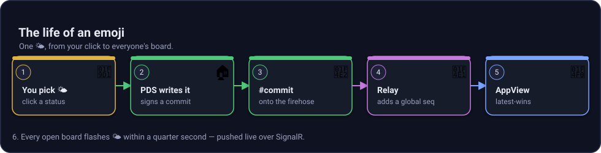

# How it works: the life of an emoji

This walkthrough follows one 🌤 status from "you click it" to "everyone sees it." Keep the email + newswire + newspaper model in mind: Personal Data Server (PDS), Relay, AppView.

## The path at a glance



*Figure: One status update becomes a signed repo commit, crosses the firehose, lands in the AppView, and pushes to browsers.*

## 1. You compose 🌤

### Plain explanation

You choose one emoji. The app turns that click into one status record.

### What the record is

The demo record is `place.selfhost.status`. It uses the literal record key `self`, which means each account has one status slot and the latest write wins.

```json
{
  "$type": "place.selfhost.status",
  "status": "🌤",
  "createdAt": "2026-07-29T16:00:00.000Z"
}
```

### Request shape

The live explorer compose endpoint writes as the demo account `you.pds.localhost`.

```bash
curl -X POST http://localhost:5193/compose \
  -H 'Content-Type: application/json' \
  -d '{ "status": "🌤" }'
```

```json
{
  "uri": "at://did:web:localhost%3A5271:pds:you/place.selfhost.status/self",
  "cid": "<record-cid>",
  "did": "did:web:localhost%3A5271:pds:you",
  "handle": "you.pds.localhost"
}
```

See it in this repo: the record contract is in `lexicons/place.selfhost.status.json`. The current AppView query and hub surface is in `src/services/AtProto.AppView/Program.cs`; the compose explorer endpoint is part of the concurrent explorer surface for the same app.

## 2. The PDS commits, signs, and stores it

### Plain explanation

Your PDS is your data home. It writes the record into your repo, signs a new commit, and can later hand you the whole repo as a CAR file.

### How it actually works

The AppView or seeder calls the PDS XRPC method `com.atproto.repo.putRecord`. The PDS authenticates the account, applies `RepoWrite.Update(collection, rkey, record)`, rebuilds the Merkle Search Tree, signs a commit, writes a CAR slice, and returns the record URI and CID.

```bash
curl -X POST http://localhost:5271/xrpc/com.atproto.repo.putRecord \
  -H 'Authorization: Bearer <accessJwt>' \
  -H 'Content-Type: application/json' \
  -d '{
    "repo": "did:web:localhost%3A5271:pds:demo1",
    "collection": "place.selfhost.status",
    "rkey": "self",
    "record": {
      "$type": "place.selfhost.status",
      "status": "🌤",
      "createdAt": "2026-07-29T16:00:00.000Z"
    }
  }'
```

```json
{
  "uri": "at://did:web:localhost%3A5271:pds:demo1/place.selfhost.status/self",
  "cid": "<record-cid>",
  "commit": {
    "cid": "<commit-cid>",
    "rev": "<tid-revision>"
  }
}
```

See it in this repo: `src/services/AtProto.Pds/PdsHost.cs` maps `putRecord`; `src/services/AtProto.Pds/PdsService.cs` publishes the commit; [`AtProto.Repo/RepoStore.cs`](https://github.com/luisquintanilla/atproto-dotnet/blob/main/src/core/AtProto.Repo/RepoStore.cs) rebuilds and signs the repo.

## 3. The PDS emits a `#commit` frame

### Plain explanation

A write is not just stored. It is announced on the live wire.

### How it actually works

The PDS publishes a Sync v1.1 `#commit` event on `com.atproto.sync.subscribeRepos`. The event includes the repo DID, the commit CID, a `rev`, the previous MST root, the changed blocks as a CAR slice, and ops such as `update place.selfhost.status/self`.

```json
{
  "seq": 42,
  "did": "did:web:localhost%3A5271:pds:demo1",
  "rev": "<tid-revision>",
  "commit": "<commit-cid>",
  "ops": [
    {
      "action": "update",
      "path": "place.selfhost.status/self",
      "cid": "<record-cid>"
    }
  ],
  "time": "2026-07-29T16:00:00.000Z"
}
```

See it in this repo: `PdsService.Commit` builds `RepoCommitEvent` and `FrameEncoder.EncodeCommit` writes the frame.

## 4. The Relay assigns a global sequence

### Plain explanation

The Relay is the newswire. It reads upstream PDS firehoses and republishes one combined feed.

### How it actually works

The Relay crawls configured upstreams, accepts monotonic repo revisions, assigns its own global sequence number, and re-emits `com.atproto.sync.subscribeRepos`. Its `getRepo` endpoint redirects to the source PDS because the Relay does not store repos.

```bash
curl http://localhost:5333/xrpc/com.atproto.sync.listHosts
```

```json
{
  "hosts": [
    {
      "hostname": "http://localhost:5271",
      "status": "active",
      "lastUpstreamSeq": 42,
      "lastError": null,
      "connectedAt": "2026-07-29T16:00:00.000Z"
    }
  ]
}
```

See it in this repo: `src/services/AtProto.Relay/RelayHost.cs`, `RelayService.cs`, and `HostRegistry.cs`.

## 5. The AppView ingests and projects latest-wins

### Plain explanation

The AppView is the newspaper. It reads the wire and keeps the latest status per account.

### How it actually works

`FirehoseIngestService` subscribes to the Relay firehose, filters for `place.selfhost.status`, reads the record block out of the commit CAR slice, and pushes `StatusUpdate` objects into the projection. The projection applies latest-wins per DID in `PresenceStore` and uses Rx.NET for timed stats.


*Figure: The write path turns one emoji into a signed commit, a global firehose event, a read-model update, and a browser push.*

See it in this repo: `src/services/AtProto.AppView/FirehoseIngestService.cs`, `PresenceProjection.cs`, `PresenceStore.cs`, and `PresenceBroadcaster.cs`.

## 6. SignalR pushes the board update

### Plain explanation

Browsers do not need to poll. The server pushes changes when the projection changes.

### How it actually works

`PresenceBroadcaster` subscribes to projection `Changes` and `Stats`. It sends `presence` deltas, coalesced to at most about 4 pushes per second, and `stats` snapshots over `/hub/presence`.

```json
{
  "did": "did:web:localhost%3A5271:pds:demo1",
  "rkey": "self",
  "cid": "<record-cid>",
  "status": "🌤",
  "seq": 43,
  "updatedAt": "2026-07-29T16:00:00.000Z",
  "removed": false
}
```

The explorer firehose ticker also listens for a `commit` event carrying raw ops:

```json
{
  "seq": 43,
  "did": "did:web:localhost%3A5271:pds:demo1",
  "time": "2026-07-29T16:00:00.000Z",
  "ops": [
    { "action": "update", "collection": "place.selfhost.status", "rkey": "self", "cid": "<record-cid>" }
  ]
}
```

See it in this repo: `/hub/presence` is mapped in `Program.cs`; `PresenceBroadcaster.cs` forwards the Rx projection to SignalR.

## 7. Click a row to inspect the real record

### Plain explanation

When you click a board row, the app can go back to the PDS and fetch the exact record by DID, collection, and record key.


*Figure: Row inspect follows the DID to the right PDS and asks for the real record by AT-URI parts.*

```bash
curl 'http://localhost:5193/inspect/record?did=did:web:localhost%3A5271:pds:demo1&collection=place.selfhost.status&rkey=self'
```

```json
{
  "uri": "at://did:web:localhost%3A5271:pds:demo1/place.selfhost.status/self",
  "cid": "<record-cid>",
  "value": {
    "$type": "place.selfhost.status",
    "status": "🌤",
    "createdAt": "2026-07-29T16:00:00.000Z"
  }
}
```

The underlying PDS call is:

```bash
curl 'http://localhost:5271/xrpc/com.atproto.repo.getRecord?repo=did:web:localhost%3A5271:pds:demo1&collection=place.selfhost.status&rkey=self'
```

See it in this repo: PDS `getRecord` is in `PdsHost.cs`. The AppView inspector endpoints are part of the concurrent explorer surface: `/inspect/record`, `/inspect/repo`, and `/inspect/car`.

## Try it live

1. Start the stack with the HTTP profile from the root README.
2. Open the board at `http://localhost:5193`.
3. Compose 🌤 with `POST /compose`.
4. Click the row to inspect the record.
5. Download the repo with `GET /inspect/car?did=did:web:localhost%3A5271:pds:demo1` or PDS `getRepo`.

The same shape is the Statusphere teaching app shape, and it is the same broad PDS + Relay + AppView pattern used by Bluesky and other atproto apps.
