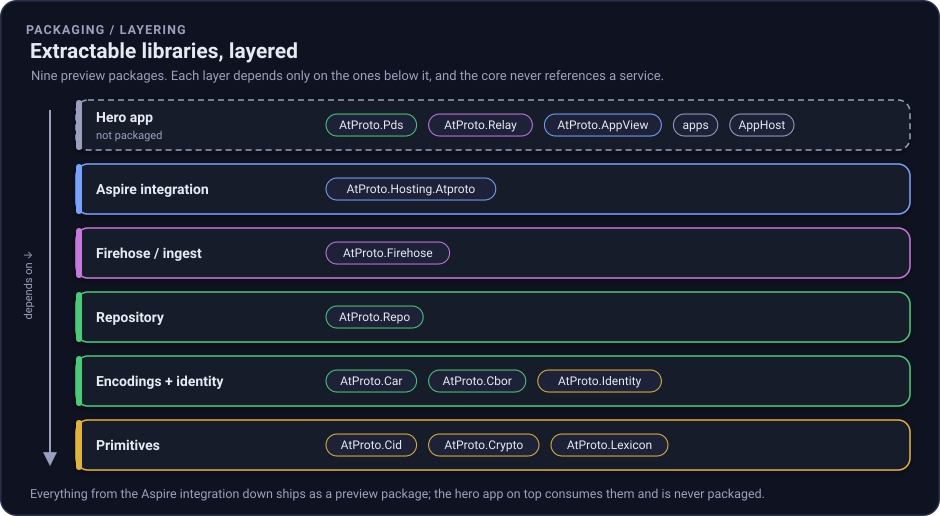

# Packaging

This repo is a **hero app first, a library set second**. Everything runs as one Aspire solution you
can clone and start. But the reusable pieces are already split into cleanly layered libraries, so when
the API surface settles they can be lifted out and shipped on their own. This page explains what is
extractable, how the layering proves the core never depends on a service, and how preview packages are
produced.

## The extractable libraries

Nine projects are marked packable. The other projects (the services, the two console apps, the AppHost,
and the tests) are deliberately **not** packaged. They are the hero app that consumes the libraries.



*Figure: Nine preview packages in layers. Each layer depends only on the ones below it, and the hero app on top is never packaged.*

| Package | Layer | What it gives you |
| --- | --- | --- |
| `AtProto.Cid` | Primitives | Content identifiers (CIDv1, dag-cbor, sha-256). |
| `AtProto.Crypto` | Primitives | secp256k1 (k256) and NIST P-256 signing. |
| `AtProto.Lexicon` | Primitives | Lexicon, NSID, and AT-URI value types. |
| `AtProto.Cbor` | Encodings + identity | Canonical DAG-CBOR encode/decode. |
| `AtProto.Car` | Encodings + identity | CARv1 read/write (the repo export format). |
| `AtProto.Identity` | Encodings + identity | DID documents, did:web resolution, and did:plc creation. |
| `AtProto.Repo` | Repository | Signed commits and the Merkle Search Tree (MST). |
| `AtProto.Firehose` | Firehose / ingest | Firehose frame decoding and the reactive ingest core. |
| `AtProto.Hosting.Atproto` | Aspire integration | .NET Aspire hosting integration for the stack. |

## Target frameworks

The eight core libraries multi-target **`net9.0` and `net10.0`**, so you can consume them from either
runtime; each preview package carries both `lib/net9.0` and `lib/net10.0` assemblies. The Aspire
integration (`AtProto.Hosting.Atproto`) targets **`net10.0`** only, matching the .NET Aspire version it
builds on.

## Why the layering matters

The rule is simple: **a library may reference only lower layers, never a service.** `AtProto.Firehose`
depends on `AtProto.Repo`, `AtProto.Car`, `AtProto.Cbor`, `AtProto.Cid`, and `AtProto.Lexicon`, and on
nothing from `AtProto.Pds`, `AtProto.Relay`, or `AtProto.AppView`. That is what makes each piece
extractable: you can take `AtProto.Car` on its own to read a CAR file, or `AtProto.Firehose` on its own
to decode a firehose, without dragging a web host along.

The dependency graph is enforced by the project references themselves, and you can see it in any
package's `.nuspec`: the sibling `<dependency>` entries only ever point at other packable libraries.

## How the gating works

Packaging is opt-in, so the hero app stays free of packaging side effects.

- **`Directory.Build.props`** sets `IsPackable=false` for every project by default, plus the shared
  metadata (authors, license `MIT`, repository URL, tags, `VersionPrefix`). These properties are inert
  for anything that never packs.
- **A library opts in** with two lines in its `.csproj`:

  ```xml
  <IsPackable>true</IsPackable>
  <Description>...</Description>
  ```

- **`Directory.Build.targets`** applies the pack-only settings (XML docs, symbol packages, SourceLink,
  the shared package README) *only* when `IsPackable` is true, so services, apps, and tests are never
  touched.

To confirm the gate, run `dotnet pack` and check the output: exactly the nine libraries above produce a
`.nupkg` (and a `.snupkg`); nothing else does.

## Versioning intent

The libraries ship as a **preview line** (`0.1.0`) and are **not published to nuget.org yet**. The
public API is still moving as the services grow (OAuth, richer identity and lexicons), and we do not
want to freeze names and signatures before they have settled. Preview artifacts let you try the
libraries and pin exact versions without implying a stability promise we cannot keep yet.

When the surface settles, publishing to nuget.org is a small step: drop the preview framing and point
the release workflow at nuget.org.

## How preview packages are produced

Locally:

```bash
dotnet pack atproto-net-selfhost-aspire.slnx --configuration Release -o ./artifacts/packages
```

In CI, the `pack` job in [`.github/workflows/ci.yml`](../.github/workflows/ci.yml) runs after the build
job, packs in Release with `ContinuousIntegrationBuild=true` (deterministic paths and SourceLink), and
uploads the `.nupkg` and `.snupkg` files as the `nuget-packages` build artifact. The `publish` job uses
the same pack command and only pushes to GitHub Packages on version tags or manual runs.

## Install from GitHub Packages

Preview packages are published to GitHub Packages, not nuget.org yet. Maintainers cut a release by
pushing a `vX.Y.Z` tag, which triggers the `publish` job and pushes the nine packable libraries to:

```text
https://nuget.pkg.github.com/luisquintanilla/index.json
```

To consume them, add the GitHub Packages source to your project or user NuGet configuration. Start from
[`docs/nuget.config.sample`](nuget.config.sample) if you want a file-based setup that keeps nuget.org
available for normal restores.

The honest papercut: GitHub Packages requires authentication even for public packages. Use a GitHub PAT
with the `read:packages` scope, then add the source with credentials. On Linux and in CI, the clear-text
password option is the portable path:

```bash
dotnet nuget add source https://nuget.pkg.github.com/luisquintanilla/index.json \
  --name github-atproto-selfhost \
  --username "$GITHUB_USERNAME" \
  --password "$GITHUB_TOKEN" \
  --store-password-in-clear-text
```

Then install a package as usual:

```bash
dotnet add package AtProto.Repo --version 0.1.0
```

### Trying a preview package from another project

Point a local NuGet feed at the packed output:

```bash
dotnet nuget add source "$(pwd)/artifacts/packages" --name atproto-preview
# then, in your project
dotnet add package AtProto.Car --version 0.1.0 --source atproto-preview
```

For a complete, runnable example, see the [`FirehoseConsumer` sample](../samples/FirehoseConsumer),
a standalone console app that references `AtProto.Firehose` as a package and decodes the live Bluesky
firehose. It restores from a local feed by default (no authentication), so it doubles as a smoke test
that the published packages are consumable outside this repository.

## The extraction path

When a library is ready to stand on its own:

1. It already builds, packs, and carries metadata. No project restructuring is needed.
2. Confirm its layer only references lower layers (the graph above), so the extracted package has no
   surprise dependency on a service.
3. Decide the public version, drop the preview framing in `Directory.Build.props`, and publish.

Until then, treat the packages as a preview of the building blocks, and the running Aspire solution as
the real product.
