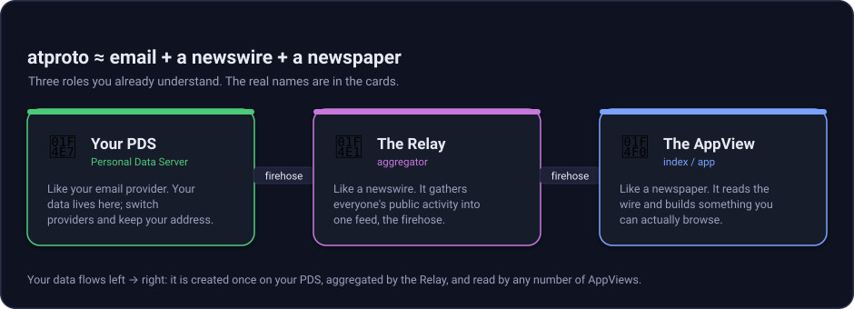
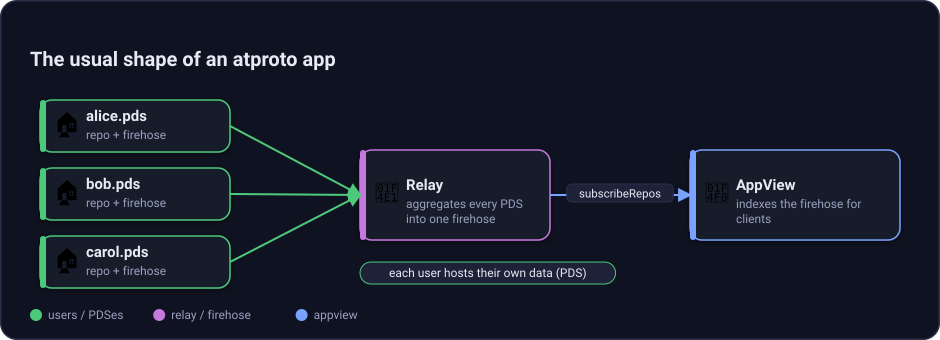
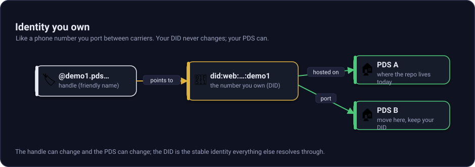
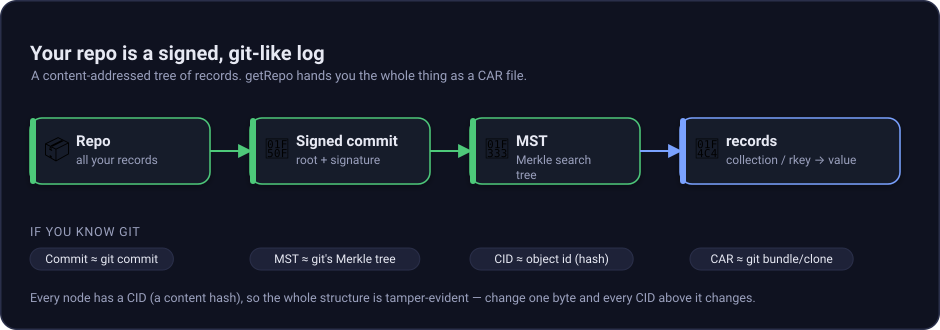
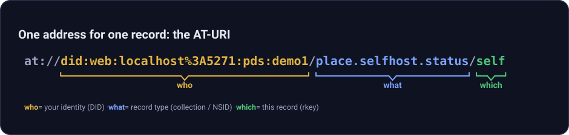

# atproto in plain language

atproto is a way to build social apps where people can own their identity and data, while apps still get a shared stream of public activity.

## atproto in one picture

The whole system is like **email + a newswire + a newspaper**. Your **Personal Data Server (PDS)** is like your email provider, your data lives there and you can switch providers. The **Relay** is like a newswire that aggregates everyone's public activity into one feed, the **firehose**. The **AppView** is like a newspaper or search index that reads the wire and builds something readable.



*Figure: Your data starts at your PDS, moves through the relay firehose, and becomes a live board in the AppView.*

## The usual shape

Most atproto apps use the same shape: people write to PDSes, relays aggregate those writes, and AppViews turn the stream into product views.



*Figure: Many data homes feed one wire, and the app reads that wire to build a useful view.*

## Identity, a phone number you own

### In one sentence

Your identity is the stable thing apps follow, even if your friendly name or host changes.

### The intuition

**Identity**, a **Decentralized Identifier (DID)**, is like a **phone number you own** and can port between carriers. Your **handle**, like `alice.pds.localhost`, is a friendly contact name that points at it.



*Figure: The DID is the stable identity, the handle is the friendly name, and the DID document says where the PDS lives.*

### How it actually works

This project uses `did:web`. The PDS service DID is `did:web:localhost%3A5271`, where the port colon is percent-encoded as `%3A`. A hosted account gets a path-based DID such as `did:web:localhost%3A5271:pds:demo1`. Its DID document is served at `/pds/demo1/did.json` and includes the `#atproto_pds` service endpoint.

### See it in this repo

- DID formatting: `src/services/AtProto.Pds/PdsOptions.cs`, `PdsIdentity`.
- DID documents: `src/services/AtProto.Pds/PdsHost.cs`, `MapIdentity`.
- Resolve a handle:

```bash
curl 'http://localhost:5271/xrpc/com.atproto.identity.resolveHandle?handle=demo1.pds.localhost'
```

## Repo, a git repo of your social data

### In one sentence

Your repo is the signed history of your public records.

### The intuition

A **repo** is like a **git repo of your social data**: a signed, content-addressed log. `getRepo` hands you a **Content Addressable aRchive (CAR)** file, like a git clone or bundle. The **MST**, or Merkle Search Tree, is like git's Merkle tree, tamper-evident. A **CID**, or Content Identifier, is like a content hash, similar to a git object id.



*Figure: A repo commit signs a tree of records, and a CAR file packages the blocks for inspection or transfer.*

### How it actually works

The PDS stores records under keys shaped as `collection/rkey`. Each write rebuilds the Merkle Search Tree, signs a new commit with secp256k1 or P-256, and writes the changed blocks into a CAR slice for the firehose event. The full repo export is also a CARv1 file.

This is a simplification. The deeper details are in the
[`AtProto.Repo` package source](https://github.com/luisquintanilla/atproto-dotnet/tree/main/src/core/AtProto.Repo),
especially `RepoStore.cs`, `Mst.cs`, and `Commits.cs`.

### See it in this repo

- Mutable repo: [`RepoStore.cs`](https://github.com/luisquintanilla/atproto-dotnet/blob/main/src/core/AtProto.Repo/RepoStore.cs).
- MST: [`Mst.cs`](https://github.com/luisquintanilla/atproto-dotnet/blob/main/src/core/AtProto.Repo/Mst.cs).
- Commit signing: [`Commits.cs`](https://github.com/luisquintanilla/atproto-dotnet/blob/main/src/core/AtProto.Repo/Commits.cs) and the [`AtProto.Crypto` package source](https://github.com/luisquintanilla/atproto-dotnet/tree/main/src/core/AtProto.Crypto).
- CAR read and write: the [`AtProto.Car` package source](https://github.com/luisquintanilla/atproto-dotnet/tree/main/src/core/AtProto.Car).
- Download a repo:

```bash
curl -L 'http://localhost:5271/xrpc/com.atproto.sync.getRepo?did=did:web:localhost%3A5271:pds:demo1' \
  -H 'Accept: application/vnd.ipld.car' \
  -o demo1.car
```

## Record

### In one sentence

A record is one JSON-like piece of app data stored in a repo.

### The intuition

For the demo, the record is a single sticky note that says, "demo1 is 🌤 right now."

### How it actually works

The demo record type is `place.selfhost.status`. It has one literal record key, `self`, so each account has one current status and updates overwrite that same slot.

```json
{
  "$type": "place.selfhost.status",
  "status": "🌤",
  "createdAt": "2026-07-29T16:00:00.000Z"
}
```

### See it in this repo

- Lexicon: `lexicons/place.selfhost.status.json`.
- PDS write endpoint: `src/services/AtProto.Pds/PdsHost.cs`, `com.atproto.repo.putRecord`.
- AppView decode path: `src/services/AtProto.AppView/FirehoseIngestService.cs`, `ReadStatus`.

## Collection and NSID

### In one sentence

A collection groups records of the same type, and its name is globally scoped.

### The intuition

A **collection** is like a folder. An **NSID**, or Namespaced Identifier, is the folder's full shared name, like a reversed domain plus a type.

### How it actually works

The status collection is `place.selfhost.status`. The record key is `self`. Together they form the repo path `place.selfhost.status/self`.

### See it in this repo

- NSID and AT-URI helpers: [`Nsid.cs`](https://github.com/luisquintanilla/atproto-dotnet/blob/main/src/core/AtProto.Lexicon/Nsid.cs) and `AtUri.cs`.
- AppView configured collection: `src/aspire/AtProto.AppHost/AppHost.cs`, `.WithCollection("place.selfhost.status")`.

## Lexicon, a shared contract

### In one sentence

A lexicon tells both sides what shape a record or endpoint has.

### The intuition

A **lexicon** is a **shared schema/contract**, like JSON Schema or OpenAPI, both sides agree on.

### How it actually works

The lexicon file declares a record named `place.selfhost.status`, requires `status` and `createdAt`, and pins the record key to literal `self`.

### See it in this repo

- `lexicons/place.selfhost.status.json`.
- Lexicon primitives: the [`AtProto.Lexicon` package source](https://github.com/luisquintanilla/atproto-dotnet/tree/main/src/core/AtProto.Lexicon).

## XRPC, typed HTTP endpoints

### In one sentence

XRPC is how atproto names HTTP endpoints with shared protocol names.

### The intuition

**XRPC** is typed HTTP endpoints. A route like `/xrpc/com.atproto.repo.getRecord` is a named protocol method.

### How it actually works

The PDS exposes account, repo, sync, and identity XRPC methods. The Relay exposes sync methods. The AppView exposes app-specific query methods for the presence board.

### See it in this repo

- PDS surface: `src/services/AtProto.Pds/PdsHost.cs`.
- Relay surface: `src/services/AtProto.Relay/RelayHost.cs`.
- AppView surface: `src/services/AtProto.AppView/Program.cs`.

## AT-URI anatomy

An **AT-URI** points at a record in a repo.



*Figure: An AT-URI says who owns the repo, what collection to read, and which record key to fetch.*

Example:

```text
at://did:web:localhost%3A5271:pds:demo1/place.selfhost.status/self
```

## PDS, Relay, AppView, and firehose

### In one sentence

The PDS stores data, the Relay aggregates public data, and the AppView turns the stream into an app.

### The intuition

Use the same email + newswire + newspaper model:

- **PDS**, Personal Data Server, is your email provider.
- **Relay** is the newswire.
- **Firehose** is the live wire feed.
- **AppView** is the newspaper or index.

### How it actually works

The PDS accepts repo writes and emits `#commit` frames on `com.atproto.sync.subscribeRepos`. The Relay subscribes to one or more upstream PDSes, assigns its own global sequence, and re-emits an aggregated firehose. The AppView subscribes to the Relay, filters `place.selfhost.status`, projects latest status per DID, and pushes changes over SignalR.

### See it in this repo

- PDS: `src/services/AtProto.Pds/`.
- Relay: `src/services/AtProto.Relay/`.
- AppView: `src/services/AtProto.AppView/`.
- Firehose library: the [`AtProto.Firehose` package source](https://github.com/luisquintanilla/atproto-dotnet/tree/main/src/core/AtProto.Firehose).
- Aspire wiring: `src/aspire/AtProto.AppHost/AppHost.cs`.

## Glossary

| Term | Plain meaning | In this repo |
| --- | --- | --- |
| AppView | The readable app view built from the wire | Presence board in `src/services/AtProto.AppView/` |
| AT-URI | A pointer to a repo record | `at://did/.../collection/rkey` |
| CAR | Portable block archive, like a git bundle | `AtProto.Car`, PDS `getRepo` |
| CID | Content hash for a block | `AtProto.Cid` |
| Collection | Folder for one record type | `place.selfhost.status` |
| DID | Stable identity you own | `did:web:localhost%3A5271:pds:demo1` |
| Firehose | Live stream of repo events | `com.atproto.sync.subscribeRepos` |
| Handle | Friendly name pointing at a DID | `demo1.pds.localhost` |
| Lexicon | Shared schema or endpoint contract | `lexicons/place.selfhost.status.json` |
| MST | Merkle Search Tree, the repo's tamper-evident tree | [`AtProto.Repo/Mst.cs`](https://github.com/luisquintanilla/atproto-dotnet/blob/main/src/core/AtProto.Repo/Mst.cs) |
| NSID | Namespaced identifier | `place.selfhost.status` |
| PDS | Personal Data Server, your data home | `src/services/AtProto.Pds/` |
| Record | One app data object | the 🌤 status JSON |
| Relay | Aggregator that republishes the firehose | `src/services/AtProto.Relay/` |
| Repo | Signed, git-like store of social data | `RepoStore` |
| XRPC | Typed HTTP endpoints | `/xrpc/com.atproto.repo.getRecord` |
