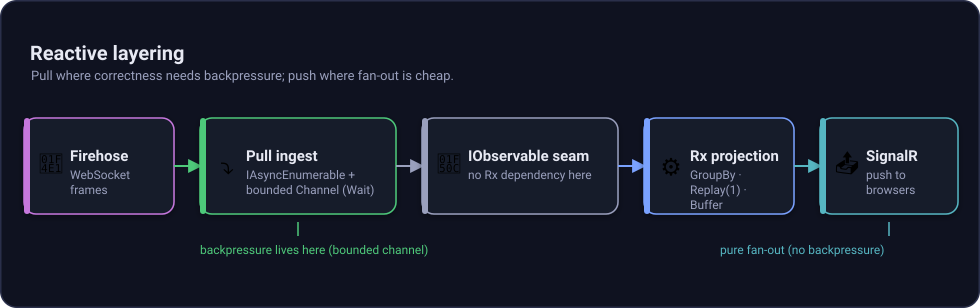

# Reactive design

The design rule is simple: keep ingest pull-based, expose an `IObservable` seam, and use Rx.NET only where it helps build read models.

## The rule

A firehose is a live stream, but the safest ingest loop is still pull-based. The code reads with `await foreach` from an `IAsyncEnumerable<RepoEvent>` backed by a bounded `System.Threading.Channels.Channel`. When the consumer slows down, the channel waits. That is where backpressure lives.

Rx.NET is then used only in the AppView projection, where push operators make sense: latest status per account, time windows, and fan-out to SignalR.

## Layering diagram



*Figure: Backpressure is in the pull ingest channel, while SignalR is a best-effort push fan-out after the projection.*

## Why ingest is pull

### In one sentence

Pull ingest lets a slow consumer slow the stream instead of building an unbounded queue.

### The intuition

Think of the firehose as a newswire printer. If the clerk gets behind, the printer should pause before paper covers the floor.

### How it actually works

`FirehoseClient.SubscribeAsync` creates a bounded channel with `BoundedChannelFullMode.Wait`. The socket reader writes decoded `RepoEvent` objects into that channel. The consumer reads with `await foreach`. If the reader stops keeping up, `WriteAsync` waits.

See it in this repo:

- [`AtProto.Firehose/FirehoseClient.cs`](https://github.com/luisquintanilla/atproto-dotnet/blob/main/src/core/AtProto.Firehose/FirehoseClient.cs), `SubscribeAsync`.
- `System.Threading.Channels.Channel` with capacity from `FirehoseOptions.ChannelCapacity`, default `1024`.
- Cursor resume happens as events are produced.

## Why the seam is `IObservable`

### In one sentence

`IObservable<T>` is the shared shape that lets projections opt into Rx without forcing Rx into core libraries.

### The intuition

The core firehose library hands you a standard outlet. If you want power tools, plug in Rx.NET in your app.

### How it actually works

`FirehoseObservable.ToObservable` adapts an `IAsyncEnumerable<T>` to the BCL `IObservable<T>` interface. The interface lives in the runtime, so `AtProto.Firehose` does not need a `System.Reactive` package reference.

See it in this repo:

- [`AtProto.Firehose/FirehoseObservable.cs`](https://github.com/luisquintanilla/atproto-dotnet/blob/main/src/core/AtProto.Firehose/FirehoseObservable.cs).
- [`AtProto.Firehose.csproj`](https://github.com/luisquintanilla/atproto-dotnet/blob/main/src/core/AtProto.Firehose/AtProto.Firehose.csproj) has no Rx dependency.

## Why Rx is scoped to AppView projection

### In one sentence

Rx is useful after ingest, where the app is building time-based and grouped read models.

### The intuition

The newspaper does not control the wire. It arranges the incoming stories into pages, summaries, and live updates.

### How it actually works

The AppView uses Rx.NET in `PresenceProjection`:

- `Changes` is a live stream of applied latest-wins updates.
- `Stats` is driven by `Buffer(TimeSpan.FromSeconds(1))`.
- Latest-per-account is conceptually `GroupBy(did).Replay(1)`, but materialized in `PresenceStore` with a `ConcurrentDictionary` so the public-firehose case does not leak one Rx group forever per DID.

See it in this repo:

- `src/services/AtProto.AppView/PresenceProjection.cs`.
- `src/services/AtProto.AppView/PresenceStore.cs`.
- `src/services/AtProto.AppView/Model.cs`.

## Where SignalR fits

### In one sentence

SignalR is the final UI push, not the backpressure mechanism.

### The intuition

Once the newspaper page is built, delivery trucks fan out copies. A slow reader does not stop the newsroom.

### How it actually works

`PresenceBroadcaster` subscribes to `Changes` and `Stats`. It sends `presence` batches coalesced to about 4 pushes per second and `stats` snapshots to all connected clients on `/hub/presence`. It uses fire-and-forget sends. A slow or absent browser can reconnect and reseed from `place.selfhost.getPresence`.

See it in this repo:

- `src/services/AtProto.AppView/PresenceBroadcaster.cs`.
- `src/services/AtProto.AppView/Program.cs`, `app.MapHub<PresenceHub>("/hub/presence")`.

## Full chain

```text
firehose IObservable -> Rx projection -> IObserver -> SignalR -> browser
```

The important split is before that chain: network ingest stays pull-based and bounded. AppView projection and browser fan-out are push-based because they are derived views, not the transport source of truth.
