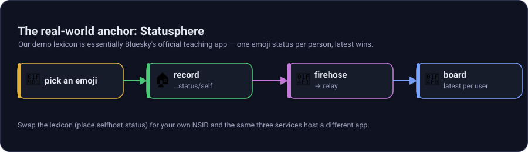
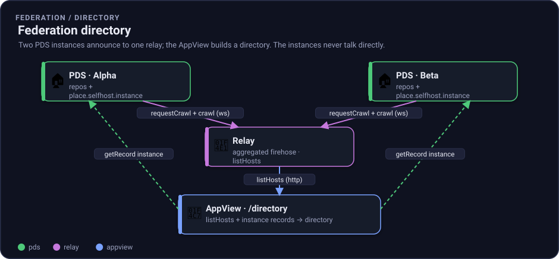

# Scenarios: why this exists

This project exists to make atproto understandable, self-hostable, and natural in .NET.

## The real-world anchor: Statusphere

The demo is a single-emoji status board with latest-wins records. That shape matches Bluesky's official teaching app, Statusphere, also called the statusphere example app.

Why that matters: Statusphere is small enough to understand, but it uses the same core protocol shape as bigger atproto apps:



*Figure: The tiny status demo uses the same PDS, Relay, and AppView shape as larger atproto applications.*

## Problems this solves

### You own your data and identity

A DID is like a phone number you own. A handle is the friendly contact name. The goal is portability: leave a provider, keep your identity and social graph.

In this repo, `did:web:localhost%3A5271:pds:demo1` is served by the local PDS at `/pds/demo1/did.json`.

### You can build on atproto in .NET

Most atproto reference material and production code is TypeScript or JavaScript. This repo proves the core protocol loop in .NET:

- DAG-CBOR, CID, CAR, and MST primitives.
- Real repo writes and signed commits.
- PDS, Relay, and AppView services.
- Reactive firehose ingest using .NET primitives.
- Aspire orchestration for local self-hosting.

### You can learn the protocol by running it

The board lets you watch a real record become a real commit and a real firehose event. Then you can inspect the AT-URI, fetch the record, and download the repo CAR.

### You can self-host the whole shape

Aspire declares the stack as a short chain: PDS, Relay, AppView. The `StatusSeeder` writes demo traffic so the board lights up without external credentials.

## Concrete scenarios

### Personal presence on your own infra

Run a small PDS, publish one status record, and let the AppView show your current emoji. The status record is intentionally tiny:

```json
{
  "$type": "place.selfhost.status",
  "status": "🌤",
  "createdAt": "2026-07-29T16:00:00.000Z"
}
```

You can later swap the emoji record for richer records without changing the broad architecture.

### Internal team "who's around" board

A team can run a private presence board on infrastructure it controls. Each person has one latest-wins status. The AppView keeps the current board while the PDS remains the source of truth.

### Reference and interop harness for .NET shops

If your team wants to understand atproto without adopting a TypeScript stack, this repo gives you concrete .NET code for:

- Content-addressed blocks and CIDs.
- CAR read and write.
- Merkle Search Tree build and read.
- Commit signing and verification.
- Firehose client and server frames.
- ASP.NET Core XRPC surfaces.

The implementation log in [plan.md](plan.md) records milestone evidence, including byte-for-byte validation against the public `atproto.com` reference repo fixtures.

### Base for richer lexicons

The status lexicon is a small shared contract. The same spine can support posts, likes, bookmarks, check-ins, or domain-specific records. The important shape stays stable:

1. Define a lexicon.
2. Write records to a repo.
3. Emit commits on the firehose.
4. Let AppViews project the stream into useful read models.

### A federation of small instances

The wire is not limited to one stack. Several small self-hosted PDS instances can announce themselves to a shared relay, and an AppView can present a directory of everyone on the wire. Each instance publishes a `place.selfhost.instance` record and `requestCrawl`s the relay on startup; the AppView's `/directory` aggregates the relay's `listHosts` with those records. The instances never connect to each other directly. They discover each other through the shared relay and directory, which is exactly how the public network scales.



*Figure: Alpha and Beta each announce to the same relay; the AppView builds a directory from what the relay aggregates. See [architecture.md](architecture.md#federation) for the wiring and [services.md](services.md) for the endpoints.*

## What this is not yet

Most of the stack is done: M0 through M5, the live SignalR board, the feel-real explorer, and most of the M6 stretch work (federation discovery, `did:plc` creation, blob support, stricter Relay MST validation, lexicon-to-C# codegen, and multi-targeting the core libraries). What remains is a full OAuth authorization server and publishing the preview libraries to nuget.org once the API surface settles.

For the implementation status, see [plan.md](plan.md). For the exact service surfaces, see [services.md](services.md).
