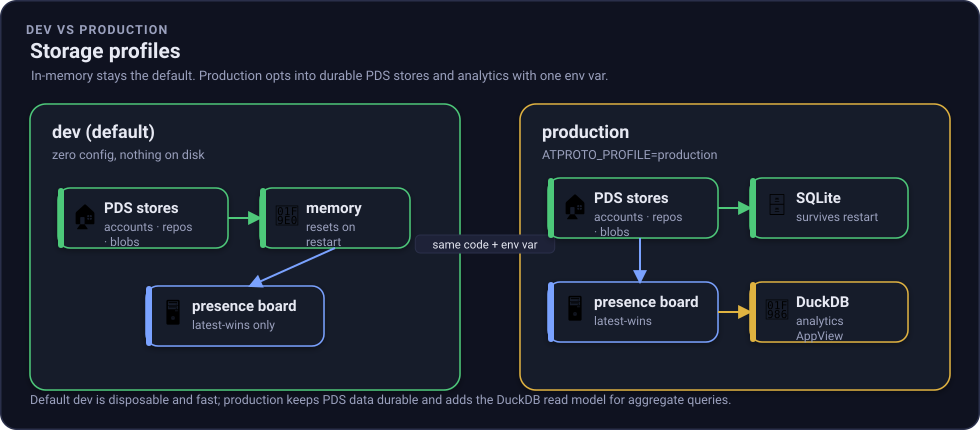

# Storage profiles: dev (in-memory) and production (durable)

The stack ships with two storage profiles. **In-memory is the default** so a first run needs zero
configuration and writes nothing to disk. **Production** is one environment variable away and makes the
Personal Data Server (PDS) durable while adding a second read model, the [DuckDB analytics
view](analytics.md).



*Figure: the same code and topology. `dev` keeps PDS state in memory and runs the presence board only;
`production` writes PDS state through to SQLite and adds the DuckDB analytics view. One env var flips it.*

## The two profiles

| | dev (default) | production |
| --- | --- | --- |
| How to run | `aspire run` (nothing extra) | `ATPROTO_PROFILE=production` |
| PDS accounts / repos / blobs | in-memory dictionaries | **SQLite**, written through on every commit |
| Survives a restart | no (disposable) | **yes** |
| Analytics AppView | not run | **DuckDB** OLAP view added |
| Native dependencies at runtime | none | SQLite + DuckDB native libraries |
| Best for | onboarding, demos, tests | a real-world self-host you can restart |

Nothing is removed by turning production on. The in-memory implementations stay the default in the
AppHost and the test default everywhere. Production **layers** durability and a second projection onto
the same PDS -> Relay -> AppView topology.

## Right tool per storage role

Storage is not one decision. Each role in the stack has a different access shape, so each gets the tool
that fits it. This is the through-line of the production profile.

| Role | dev default | production | Why the production choice |
| --- | --- | --- | --- |
| PDS repo / blobs / accounts (source of truth) | in-memory dicts | **SQLite** | OLTP: small frequent writes, point lookups, commit transactions. The atproto-canonical choice for a repo. |
| Analytics AppView | (not run) | **DuckDB** | OLAP: columnar `GROUP BY`, time-series, top-N over the whole firehose. |
| Presence AppView | in-memory KV | in-memory KV | Latest-wins point lookup; a key/value read model is correct at any scale here. |
| Relay cursors / global sequence | file (`ICursorStore`) | file (`ICursorStore`) | Already durable; a single small append point. |
| Firehose durability / scale-out | in-memory broadcaster | in-memory broadcaster | The firehose is a derived stream; a broker is an [optional seam](extending.md#when-would-you-add-a-message-broker-natsjetstream), documented not built. |

## How to run production

```bash
# WSL / all-HTTP (most reliable on WSL, see the README note):
ASPIRE_ALLOW_UNSECURED_TRANSPORT=true ATPROTO_PROFILE=production \
  dotnet run --project src/aspire/AtProto.AppHost/AtProto.AppHost.csproj --launch-profile http

# Or with the Aspire CLI:
ATPROTO_PROFILE=production aspire run --project src/aspire/AtProto.AppHost
```

In production the dashboard shows the usual PDS, Relay, and presence AppView, plus an
**`analyticsview`** resource. Each PDS writes its SQLite file under the AppHost's
`atproto-data/` directory (`pds/pds.db`, `pds-b/pds-b.db`), and the analytics view writes
`atproto-data/analytics/analytics.duckdb`. Stop the stack, start it again, and the PDS accounts,
repositories, and blobs are still there.

## What the PDS persists (SQLite)

The PDS repository is fundamentally an in-memory structure (a live Merkle Search Tree over the
commit chain and block store). So durability is a **write-through persistence seam**
(`IPdsPersistence`), not a swap of the in-memory store. The in-memory `AccountStore` / `BlobStore` and
the live `RepoStore` stay the read models; SQLite is written through on every successful account
creation, commit, and blob upload, and replayed on startup.

One SQLite database per PDS instance (a pragmatic simplification of atproto's per-actor convention;
still durable and inspectable with any SQLite tool):

```sql
accounts     (did PK, handle, account_id, key_type, signing_key_sec1, pw_salt, pw_hash, created_at)
repo_blocks  (did, cid, bytes, PRIMARY KEY (did, cid))      -- the reachable block set (commit + MST nodes + records)
repo_records (did, path, cid, PRIMARY KEY (did, path))      -- path -> record CID
repo_head    (did PK, head_cid, rev)                        -- current signed head + revision
blobs        (cid PK, content_type, bytes)
```

The signing key is stored via `EcKeypair.ExportPrivateKey()` (SEC1) and re-imported on load, so a
rehydrated account keeps signing new commits with the same key.

### Reconstruction is verified, not trusted

ECDSA signatures are non-deterministic, so a persisted commit cannot be re-signed to reproduce its
Content Identifier (CID). On startup the PDS therefore restores the **original** persisted commit bytes,
rebuilds the Merkle Search Tree from `repo_records`, and asserts the rebuilt root equals the persisted
commit's `data` CID, the same root-CID discipline the M3 write gate uses. It then seeds the TID clock
past the persisted revision so `rev` stays monotonic across a restart. If the rebuilt root does not
match, load fails loudly rather than serving a corrupt repository.

## Configuration

The AppHost sets these for you in the production profile (via `WithSqliteStorage(path)` in
`AtProto.Hosting.Atproto`). To run the PDS standalone with durability:

| Key | Default | Meaning |
| --- | --- | --- |
| `Pds:Storage` | `memory` | `memory` (default) or `sqlite`. |
| `Pds:SqlitePath` | (in-memory) | Path to the SQLite database file when `Storage=sqlite`. |

```bash
Pds__Storage=sqlite Pds__SqlitePath=./data/pds.db \
  dotnet run --project src/services/AtProto.Pds
```

## Verify durability yourself

`tests/AtProto.Pds.Tests/PersistenceTests.cs` proves it: it boots a real PDS over Kestrel with
`Storage=sqlite`, registers an account, writes records, and uploads a blob; then it disposes that PDS
and boots a **fresh** one over the **same** SQLite file and asserts the account, the repository head and
records, a signature-verifiable commit, and the blob all survive, and that `rev` keeps climbing. The
default in-memory profile is exercised by every other test.

```bash
dotnet test tests/AtProto.Pds.Tests
```

## See also

- [Analytics view](analytics.md), the DuckDB OLAP projection that production adds.
- [Extending: persist or swap storage](extending.md#path-f---persist-or-swap-storage), the seam pattern.
- [Architecture](architecture.md), the full service wiring.
